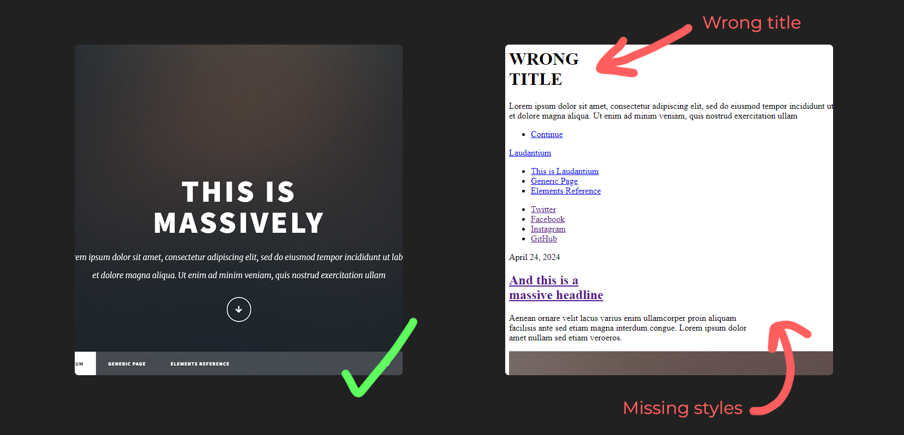

import easier from "@assets/ai-replace/ai-meme.png";
import research from "@assets/ai-replace/ai-research.webp";
import amazedFace from "@assets/git-bisect/amazed-face.gif";
import sadCat from "@assets/git-bisect/sadcat.png";
import Note from "@components/content/Note.astro";
import { Image } from "astro:assets";
import H2 from "@components/content/H2.svelte";
import H3 from "@components/content/H3.svelte";
import H4 from "@components/content/H4.svelte";
import ImageZoom from "@components/content/ImageZoom.svelte";

Utilizing heavily AI tools provides a productivity boost and speed unmatched to what
was ever capable up until now. Or is it?

That setence is being heavily challenged by many arguing that the productivity
boost and extra velocity coming from AI generated code is translated into
an amalgamation of all sorts issues such as:
* low quality
* "bad taste" code
* security vulnerabilities
* poor architectural decisions

Nevertheless many of us have this feeling that we need to integrate it more somehow in our workflows either because of FOMO
(fear of missing out) or because we actually managed be more productive with it to a certain degree. Which then begs the
question.

<H2 title="What should we delegate to AI?" />
Does it really matter how and in which workflows we introduce these tools in?

One could argue that the more we delegate to AI, the more we can focus on other aspects of our work,
such as problem-solving, creativity, and strategic planning.

But is this accurate?

Could we really detach ourselves from writing code all together?
Is it possible to automate the entire development/thinking process?

<div class="flex justify-center items-center">
	<Image src={easier} alt="ai meme about llms writing 100% of our code" class="w-100" />
</div>

The answer to these questions is highly subjective and depends on:
* context
* complexity
* goals
* severity of the software failing

For example if you are in the aviation business I highly doubt you'll have any AI generated code
written anytime soon. At least I hope so..

However when stakes are lower maybe we could afford to dip into the fobidden fruit, right?
Sure the code quality could take a hit but who cares? I mean, technically given enough tokens/iterations maybe either by pure chance
or struggle AI could manage to satisfy our needs, they are after all probabilistic. Lets assume costs/development time increases,
but lets focus on the fact we didn't need to think much of **implementation details**. Isn't that a net positive?

Well it depends... <a href="https://www.anthropic.com/research/AI-assistance-coding-skills">Research</a>
so far suggests that aggresively delegating your coding tasks to AI impacts your skill formation.

<div class="flex flex-col justify-center items-center">
	<ImageZoom client:load>
		<Image src={research} alt="anthropic research on how ai impacts skill formation" class="w-200" />
	</ImageZoom>
	<p><i>Note: Click twice to zoom</i></p>
</div>

And its not suprising, the absence of struggle on learning something new
**always** hinders progression. If I want to improve at understanding code (at least
the "tough" parts) not writting it myself is the best way to slowly fade in obscurity.

<H2 title="Not all coding tasks are the same" />
To avoid the fear mongering, we need to address that not all coding tasks are the same.
If you managed to re-style that blue button into red or you made another
CRUD app for the 100th time, you can safely delegate it into AI you are not missing
out anything. In fact AI may end up doing a better job as well for these since the examples are countless out there.

However if you haven't made any CRUD app before and you need to learn how, using AI to
**specifically write code** for you, then you definitely doing yourself a disservice, you are not
going fast you are just wasting fuel.

For example in my home server I'm hosting a modded <a href="https://en.wikipedia.org/wiki/Palworld">PalWorld</a> server
to play with friends. Because the game is in early access updating the server on a newer version could break the
clients and it demands some manual steps depending on the version.

I really don't care on how the specifics of that works, neither I want
to delegate time to learn how to, which makes it a perfect candinate to use AI for it.

We notice that there are two new bugs appearing compared to the old version:


```sh
> git rebase -i 1e094edc1a54fa883e68a937c7ad96d095bf2a0d^

# pick 1e094ed fix: month should be in aug <-- Delete this or comment it out
pick fa67797 feat: change the name
pick 687e5eb chore: remove more comments
pick 1b7284d feat: change the date
pick 84a4b45 fix: change the date for all the links
pick 1544cff chore: version bump
pick 39f2d62 chore: update project desc
Successfully rebased and updated refs/heads/master.
```
Let's check now our site again while on `master` branch:

Nice! We got our styles back. However our title is still wrong... <Image src={sadCat} alt="sad cat" style={"width: 35px;display: inline;margin: 0;"} />
<br/>

<H3 title="Automating git bisect" />
Let's try now to find the faulty commit again but this time make git do the check for us based on a "condition" we give it.
```sh
> git bisect start
> git bisect bad          # To mark current branch (master) as a bad commit
> git bisect good e4824da # We mark as good the same commit because it solves the issue
Bisecting: 3 revisions left to test after this (roughly 2 steps)
[687e5eb387387eb6476e4bf59b348e14159217a8] chore: remove more comments
```
But now I want to provide Git a custom test case I wrote for this specific bug which I want it to check everytime bisect a new commit.
```typescript
it('has the correct title in the intro section', () => {
    const introDiv = container.querySelector('#intro');
    const h1 = introDiv.querySelector('h1');
    expect(h1.textContent.replace(/\s/g, '')).toBe('ThisisMassively');
});
```
Let's use Git to automatically test each commit and mark them as "bad" or "good" based on whether the test case passes or fails.
```sh
> git bisect run npm test
running  'npm' 'test'

> git-bisect@1.0.0 test
> jest

 PASS  ./test_index.spec.js
 FAIL  ./custom-test.spec.js
  ● index.html › has the correct title in the intro section

    expect(received).toBe(expected) // Object.is equality

    Expected: "ThisisMassively"
    Received: "WRONGTITLE"

      17 |     const introDiv = container.querySelector('#intro');
      18 |     const h1 = introDiv.querySelector('h1');
    > 19 |     expect(h1.textContent.replace(/\s/g, '')).toBe('ThisisMassively');
         |                                               ^
      20 |   });
      21 | });
      22 |

      at Object.toBe (custom-test.spec.js:19:47)

Test Suites: 1 failed, 1 passed, 2 total
Tests:       1 failed, 4 passed, 5 total
Snapshots:   0 total
Time:        1.024 s
Ran all test suites.
Bisecting: 0 revisions left to test after this (roughly 1 step)
[fa67797db045c96d2d92e5ce3026904287f227e5] feat: change the name
running  'npm' 'test'

> git-bisect@1.0.0 test
> jest

 PASS  ./custom-test.spec.js
 PASS  ./test_index.spec.js

Test Suites: 2 passed, 2 total
Tests:       5 passed, 5 total
Snapshots:   0 total
Time:        0.94 s, estimated 1 s
Ran all test suites.

############################
# It found the bad commit!
687e5eb387387eb6476e4bf59b348e14159217a8 is the first bad commit
commit 687e5eb387387eb6476e4bf59b348e14159217a8
Author: cloud-np <nipa04@betssongroup.com>
Date:   Tue Sep 24 13:25:48 2024 +0200

    chore: remove more comments

    ref: #T-10

 index.html | 11 ++---------
 1 file changed, 2 insertions(+), 9 deletions(-)
bisect found first bad commit
############################
```
As demonstrated above, `git bisect run` executed the command we provided, multiple times across different commits in the repository's history.
This automated process efficiently identified the first commit where our test succeeded, indicating that the commit immediately preceding it
was the first "bad" commit that introduced the issue.

Now we can remove this faulty commit the same way we did before:
```sh
> git rebase -i 687e5eb387387eb6476e4bf59b348e14159217a8^
```

Sure one could argue our job becomes more **reactive** vs **generative** and the creativeness slowly
fades since we now reacting on issues produces from the LLM output rather than thinking but who cares our job just become easier right?


*Well maybe we should delegate the work of thinking about what to delegate to AI to AI itself.*

I think this setence alone captures perfectly the irony of the modern development and how the average developer
is going to try to tackle any problem he may be facing.

<Note title="Note">
	"LLMs are probabilistic models which generate a completion to a prompt, they do this one token at a time and produce non-deterministic results."
</Note>

## Nice closer
Unless AI will become fully autonomous on writting software this won't be changing anytime soon.
You'll still need to struggle if you want to improve at coding.
