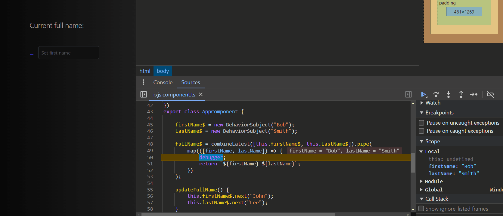

import Note from "../../components/Note/Note.astro";
import { Image } from "astro:assets";
import what from "../../assets/angular-signals/what-no-bg.png";
import defaultCd from "../../assets/angular-signals/default_cd.svg";
import onPushCd from "../../assets/angular-signals/on_push_cd.svg";
import signalsCd from "../../assets/angular-signals/on_push_signals_cd.svg";
import butTheresMore from "../../assets/angular-signals/but-theres-more.webp";


<Note title="Note">
    This is not a tutorial on signals; there are already many excellent resources available online. 
    Instead, we'll provide a high-level overview of the benefits signals offer and their integration within the Angular ecosystem.
</Note>

### Quick history throughback

In 2020, Ryan Carniato introduced SolidJS, a declarative UI framework that distinguished itself from the mainstream use of virtual DOMs
which was popular at the time. Unlike the conventional approach, Ryan's work emphasized reactivity through the innovative use of signals,
offering a unique perspective on UI development. And while reactive programming including singals (MobX, Ember auto tracking computing properties)
has been arround for a while Ryan focused more on performance and simplicity. That made other frameworks quickly recognize the potensial to his approach
and they started implementing it inside their core libraries (Vue, Preact, Qwik).

### Signals In Angular!
Angular also evolved, and with Angular v16 last May, three new reactive primitives were introduced in developers preview. The three new primitives where:
    1. -- Writeable Signals
```typescript title="signals.ts"
const count: Writeable<number> = signal(1);
console.log(count());  // 1
```
    2. -- Computed
```typescript title="signals.ts"
const count = signal(1);

const doubleCount = computed(() => count() * 2);
console.log(doubleCount());  // 2
```
    3. -- Effects
```typescript title="signals.ts"
const count = signal(1);

effect(() =>
    console.log("Count's new value is: ", count());  // Count's new value is: 1
);
```
These primitives represents Angulars ongoing commitment to provide a better developer experience.
Just by reading the code we can tell that signals have a clear intent. They seem intuitive (spoiler most of the time they are)
and they are quite readable.

### But... what are Angular Signals?
Well let's see what the Angular docs have to say:


<Image src={what} alt="the office meme what" style={"width: 300px"} />


Well.. lets break this down a bit with an example here:

Here Signals have a clear intent. Demonstrated by how the `fullName` signal instantly reacts by getting
recomputed every time the `firstName` signal is updated. By that we can derive that signals are indeed:
    * -- *"A system that allows us to track how our application state is used"*. 

However, there's a key concept to highlight here that we have mentioned yet: the term `granularly`.

### Granular updates and fine-grained reactivity.

To get a better idea what Angular docs are reffering to when they say `granularly`, lets see how 
Angular's Change Detection is currently working in Angular.

#### 1. Angular's Default Change Detection

By default Angular's change detection utilizies a library called [Zone.js](https://www.npmjs.com/package/zone.js?activeTab=readme)
which [monkey patches](https://en.wikipedia.org/wiki/Monkey_patch) asynchronous operations like UI Events, Promises and timeouts.
With that Zone.js informs Angular that something may have changed inside of one of the components. But it doesn't pintpoint that
leaving Angular guessing where the change may have occurred.

This meens that Angular has to reside to Change Detection Mechanism called "dirty checking", which means that Angular has to check
all data bound properties of a component to compare the changes since the last change detection cycle occurred.
<Image src={defaultCd} style="width: 300px;" alt="default change detection in angular graph" />
As we can see from the above graph as well Angular is checking the whole component tree to verify that the DOM is in sync with the data.
Even though our change occurred in one of our components Angular doesn't know which one it is and to verify that everything is synchronized
it has to check every single one of them. This change detection mechanism in complex applications, it hinders the performance dramatically,
and to compensate with that Angular gives us another change detection strategy called `OnPush`.

#### 2. Change Detection Strategy **OnPush**

OnPush basically checks only if the input properties of a component have changed (`@Input()`) since the last change detection cycle and if we manually trigger 
change detection, like this:

```typescript title="onpush.component.ts" {12}
@Component({
    selector: 'app-onpush',
    template: `<!-- our template -->`,
    changeDetection: ChangeDetectionStrategy.OnPush
})
export class OnpushComponent {
    cdr = inject(ChangeDetectionRef);

    someMethod() {
        setTimeout(() => {
            // ... code that changes the component state
            this.cdr.markForCheck(); // Marks component as "dirty", to be checked.
        }, 1000);
    }
}
```
The above example marks the component as "dirty" after one second when we invoke the `someMethod` function. This means
that the next time Angular will run a Change Detection cycle it will also check that specific component for any changes.
<Image src={onPushCd} style="width: 300px;" alt="onpush change detection strategy in angular graph" />
From the graph we can tell that now we have reduced the scope of the change detection cycle, but we also reduce the frequency
as well. This can improve performance significally and we have much more control over what is being rendered and when.
But.. there is a drawback. Now this becomes the responsibility of the developer to know exactly when the data is in sync with the UI
which makes the learning curve of Angular even more steep.

#### 3. Change Detection with Signals 
With the integration of signals, Angular's change detection becomes even more efficient, targeting updates with precision.
Change detection now is scoped to the components directly affected by the changes. This means that when a signal is updated
Angular is equipped to identify the exact location and component that required UI synchronization.
```html title="signals.component.html" {3}
<div> ... </div>

<div>{{ count() }}</div> <!-- Only this part of the DOM gets updated. -->

<div> ... </div>
```
This selective rendering ensures that only the necessary parts of the UI are getting updated.

The change detection still happens at the component level.
<Image src={signalsCd} style="width: 300px;" alt="signals change detection in angular graph" />

But Angular optimizes this process to update only the necessary parts of the DOM. In other words
we **granularly** update ONLY the parts of the DOM that needs to be udpated.

Not only that but signals opens us the door for a zoneless future as well.
Now we can build using a signal based reactivity model. This model does not rely on Zone.js
for change detection. Instead, it uses signals to explicitly notify the Angular framework 
when the model changes. There will still be backward compatibility with Zone.js but making it optional
is another step to the right direction.

### The true power of signals.
<Image src={butTheresMore} style="width: 500px;" alt="but theres more meme" />
The other reasons that signals are so welcomed by the community are the following:
    * -- Simplicity & ease of use 
    * -- Readability
    * -- Direct depedency tracking

```typescript title="signals.component.ts"
firstName = signal("Bob");
lastName = signal("Smith");

fullName = computed(() => `${this.firstName()} ${this.lastName()}`);

isFullNmaeLengthy = computed(() => this.fullName().length > 10);
```
As we can see by the example as well signals have a clear intent. They directly
represent the values and their changes, making the flow of data more transparent
and overall easier to follow. Moreover with signals its easier to see and understand
how values depend on each other, as we explicity define the depedencies in the computed
properties:
```typescript
fullName = computed(() => `${this.firstName()} ${this.lastName()}`);
```
I also didn't need to handle a subscription to access my value, and all the depedencies
were automatically tracked and updated for me with efficiently.

But most imporantly I didn't have to be an Rxjs wisard to start implementing reactivity
to my Angular application... and actually I don't even to know anything regarding RxJs
or its operators to have reactivity. I believe this fact to be a great selling point
especially for newcomers that may feel intimidated learning Angular and its declerative
paradigm because of its learning curve and complexity.

### The Diamond problem

Signals helps us solve another issue named: *The Diamond problem*.
To understand The Diamond problem lets first look a signal implementation:

#### 1. Signals
```typescript title="signals.ts"
firstName = signal("Bob");
lastName = signal("Smith");

fullName = computed(() => `${this.firstName()} ${this.lastName()}`);

updateFullName() {
    this.firstName.set("John");
    this.lastName.set("Smith");
}
```
In the above example when we initially load the component `fullName` will hold the value
'Bob Smith' then when we trigger the `updateFullname` function the value will be re-computed
to 'John Lee'.

#### 2. RxJs
With RxJs is not that simple. There couple things we have to keep in mind. First of all
we are dealing with `Observables` which means that inpput streams could not hold a value.
Additionally we also need to keep in mind that `combineLatest` operator will emit a value
only when all the input streams have at least one value. But most imporstantly when we
invoke `updateFullName` function because we push to `firstName$` observable first we `combineLatest`
will emit a the new value for `firstName$` but it will emit all the previous values from the rest
of the streams. Then shortly after it will emit again the updated values for both of the Observables.
This means for a very short amount of time we have a transient state were the data is not synchronized
with the UI and the emition is not correct. Here is a demonstration to make this clearer:



### No silver bullet.
In programming, no single solution fits all scenarios, a principle that applies when comparing signals
with RxJS. Signals offer a more accessible syntax and operation for simpler synchronization tasks but fall
short in handling asynchronous reactivity. RxJS, with its comprehensive suite of operators like `debounceTime`,
`distinctUntilChanged`, and others, excels in managing complex asynchronous data streams.

To illustrate how signals lag in this aspect, let's examine implementations of a search functionality using both RxJS and signals.
```typescript title="rxjs.ts"
http = inject(HttpClient);
firstName$ = new Subject<string>();

// The users$ observable will listen to the firstName$ changes.
users$ = this.firstName$.pipe(
    debounceTime(200),
    distinctUntilChanged(),
    switchMap((firstName) =>
        this.http.get<User[]>(`${BASE_URL}/users?firstName=${firstName}`)
    )
);

search(event: Event) {
    const value = (event.target as HTMLInputElement).value;
    this.firstName$.next(value);
}
```
RxJS operators showcase their power and directness through high-level abstractions and the 
capability to handle complex operations. Specifically, the switchMap operator stands out by
canceling previous subscriptions and emitting only the latest values. Attempting to replicate
this behavior with signals presents an interesting challenge:
```typescript title="signals.ts"

http = inject(HttpClient);
lastSearch = ''; // Track the last search term to mimic `distinctUntilChanged`.
searchTimeout: any = null; // For debouncing

users: User[] = []; // This will store the fetched users

// Mimicking `debounceTime` and `distinctUntilChanged`
search(event: Event) {
    const value = (event.target as HTMLInputElement).value;
    if (value === this.lastSearch) return; // mimic `distinctUntilChanged`
    this.lastSearch = value;

    if (this.searchTimeout) clearTimeout(this.searchTimeout); // Clear previous debounce timer

    this.searchTimeout = setTimeout(() => {
        this.fetchUsers(value);
    }, 200); // Debounce time of 200ms
}

fetchUsers(firstName: string) {
    this.http.get<User[]>(`${BASE_URL}/users?firstName=${firstName}`).subscribe((users) => {
        this.users = users;
    });
}
```
Attempting to replicate RxJS operators with signals proves challenging, affects readability, and
importantly, deviates from the declarative paradigm, leading to excessive imperative coding for
similar results. 

Additionally, this approach risks creating race conditions due to varying server responses and the
lack of mechanisms for canceling previous subscriptions, a feature `switchMap` efficiently manages.
```typescript {2}
fetchUsers() {
    this.http.get<User[]>(`${BASE_URL}/users?firstName=${firstName}`).subscribe((users) => {
        this.users = users;
    });
}
```

### RxJs + Signals

The optimal strategy involves using RxJS and signals in tandem, aligning with the Angular team's recommended approach.
```typescript title="rxjs-signals.ts"
http = inject(HttpClient);
#search = signal<string>('');
users$ = toObservable(this.#search).pipe(
    debounceTime(200),
    distinctUntilChanged(),
    switchMap((firstName) =>
        this.http.get<User[]>(`${BASE_URL}/users?firstname_like=${firstName}`
    )
));

users = toSignal(this.users$);

search(event: Event) {
    const value = (event.target as HTMLInputElement).value;
    this.#search.set(value);
}
```
The Angular team provides two functions for this integration: `toObservable`, which converts a signal into
an Observable, and `toSignal`, which transforms an Observable into a signal.

#### Why use them together?
Combining them harnesses the strengths of both methods. RxJS shines in managing asynchronous operations with
its sophisticated abstractions for events, HTTP requests, and timers. Signals, on the other hand, excel in simpler
tasks, enhancing state management's simplicity and readability without the complexity of RxJS observables. Integrating
them improves performance, readability, and scalability, overall leading to the development of more robust applications.
