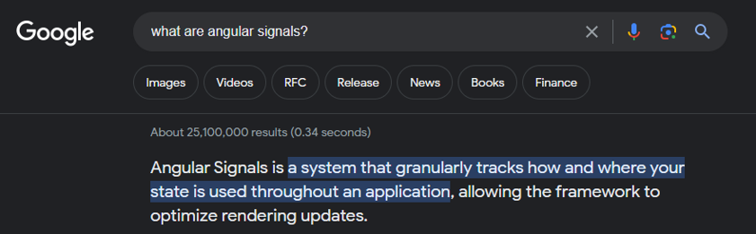
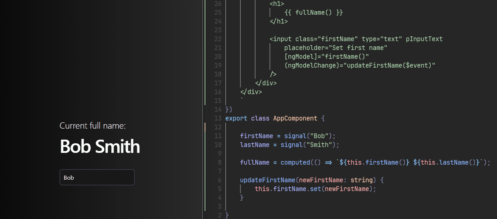

import Note from "../../components/Note/Note.astro";
import { Image } from "astro:assets";
import what from "../../assets/angular-signals/what-no-bg.png";
import defaultCd from "../../assets/angular-signals/default_cd.svg";
import onPushCd from "../../assets/angular-signals/on_push_cd.svg";
import signalsCd from "../../assets/angular-signals/on_push_signals_cd.svg";


<Note title="Note">
    This is not a tutorial on signals; there are already many excellent resources available online. 
    Instead, we'll provide a high-level overview of the benefits signals offer and their integration within the Angular ecosystem.
</Note>

### Quick history throughback

In 2020, Ryan Carniato introduced SolidJS, a declarative UI framework that distinguished itself from the mainstream use of virtual DOMs
which was popular at the time. Unlike the conventional approach, Ryan's work emphasized reactivity through the innovative use of signals,
offering a unique perspective on UI development. And while reactive programming including singals (MobX, Ember auto tracking computing properties)
has been arround for a while Ryan focused more on performance and simplicity. That made other frameworks quickly recognize the potensial to his approach
and they started implementing it inside their core libraries (Vue, Preact, Qwik).

### Signals In Angular!
Angular also evolved, and with Angular v16 last May, three new reactive primitives were introduced in developers preview. The three new primitives where:
    1. -- Writeable Signals
```typescript title="signals.ts"
const count: Writeable<number> = signal(1);
console.log(count());  // 1
```
    2. -- Computed
```typescript title="signals.ts"
const count = signal(1);

const doubleCount = computed(() => count() * 2);
console.log(doubleCount());  // 2
```
    3. -- Effects
```typescript title="signals.ts"
const count = signal(1);

effect(() =>
    console.log("Count's new value is: ", count());  // Count's new value is: 1
);
```
These primitives represents Angulars ongoing commitment to provide a better developer experience.
Just by reading the code we can tell that signals have a clear intent. They seem intuitive (spoiler most of the time they are)
and they are quite readable.

### But... what are Angular Signals?
Well let's see what the Angular docs have to say:


<Image src={what} alt="the office meme what" style={"width: 300px"} />


Well.. lets break this down a bit with an example here:

Here Signals have a clear intent. Demonstrated by how the `fullName` signal instantly reacts by getting
recomputed every time the `firstName` signal is updated. By that we can derive that signals are indeed:
    * -- *"A system that allows us to track how our application state is used"*. 

However, there's a key concept to highlight here that we have mentioned yet: the term `granularly`.

### Granular updates and fine-grained reactivity.

To get a better idea what Angular docs are reffering to when they say `granularly`, lets see how 
Angular's Change Detection is currently working in Angular.

#### 1. Angular's Default Change Detection

By default Angular's change detection utilizies a library called [Zone.js](https://www.npmjs.com/package/zone.js?activeTab=readme)
which [monkey patches](https://en.wikipedia.org/wiki/Monkey_patch) asynchronous operations like UI Events, Promises and timeouts.
With that Zone.js informs Angular that something may have changed inside of one of the components. But it doesn't pintpoint that
leaving Angular guessing where the change may have occurred.

This meens that Angular has to reside to Change Detection Mechanism called "dirty checking", which means that Angular has to check
all data bound properties of a component to compare the changes since the last change detection cycle occurred.
<Image src={defaultCd} style="width: 300px;" alt="default change detection in angular graph" />
As we can see from the above graph as well Angular is checking the whole component tree to verify that the DOM is in sync with the data.
Even though our change occurred in one of our components Angular doesn't know which one it is and to verify that everything is synchronized
it has to check every single one of them. This change detection mechanism in complex applications, it hinders the performance dramatically,
and to compensate with that Angular gives us another change detection strategy called `OnPush`.

#### 2. Change Detection Strategy **OnPush**

OnPush basically checks only if the input properties of a component have changed (`@Input()`) since the last change detection cycle and if we manually trigger 
change detection, like this:

```typescript title="onpush.component.ts" {12}
@Component({
    selector: 'app-onpush',
    template: `<!-- our template -->`,
    changeDetection: ChangeDetectionStrategy.OnPush
})
export class OnpushComponent {
    cdr = inject(ChangeDetectionRef);

    someMethod() {
        setTimeout(() => {
            // ... code that changes the component state
            this.cdr.markForCheck(); // Marks component as "dirty", to be checked.
        }, 1000);
    }
}
```
The above example marks the component as "dirty" after one second when we invoke the `someMethod` function. This means
that the next time Angular will run a Change Detection cycle it will also check that specific component for any changes.
<Image src={onPushCd} style="width: 300px;" alt="onpush change detection strategy in angular graph" />
From the graph we can tell that now we have reduced the scope of the change detection cycle, but we also reduce the frequency
as well. This can improve performance significally and we have much more control over what is being rendered and when.
But.. there is a drawback. Now this becomes the responsibility of the developer to know exactly when the data is in sync with the UI
which makes the learning curve of Angular even more steep.

#### 3. Change Detection with Signals 
With the integration of signals, Angular's change detection becomes even more efficient, targeting updates with precision.
Change detection now is scoped to the components directly affected by the changes. This means that when a signal is updated
Angular is equipped to identify the exact location and component that required UI synchronization.
```html title="signals.component.html" {3}
<div> ... </div>

<div>{{ count() }}</div> <!-- Only this part of the DOM gets updated. -->

<div> ... </div>
```
This selective rendering ensures that only the necessary parts of the UI are getting updated.

The change detection still happens at the component level.
<Image src={signalsCd} style="width: 300px;" alt="signals change detection in angular graph" />

But Angular optimizes this process to update only the necessary parts of the DOM. In other words
we **granularly** update ONLY the parts of the DOM that needs to be udpated.

Not only that but signals opens us the door for a zoneless future as well.

This meens that Angular has to reside to Change Detection Mechanism called "dirty checking", which means that Angular has to check
all data bound properties of a component to compare the changes since the last change detection cycle occurred.
As we can see from the above graph as well Angular is checking the whole component tree to verify that the DOM is in sync with the data.
Even though our change occurred in one of our components Angular doesn't know which one it is and to verify that everything is synchronized
it has to check every single one of them.
