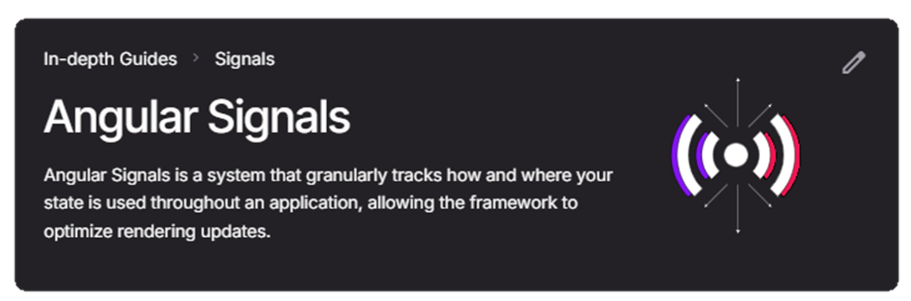
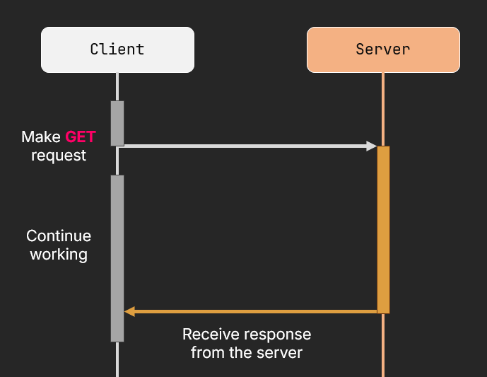
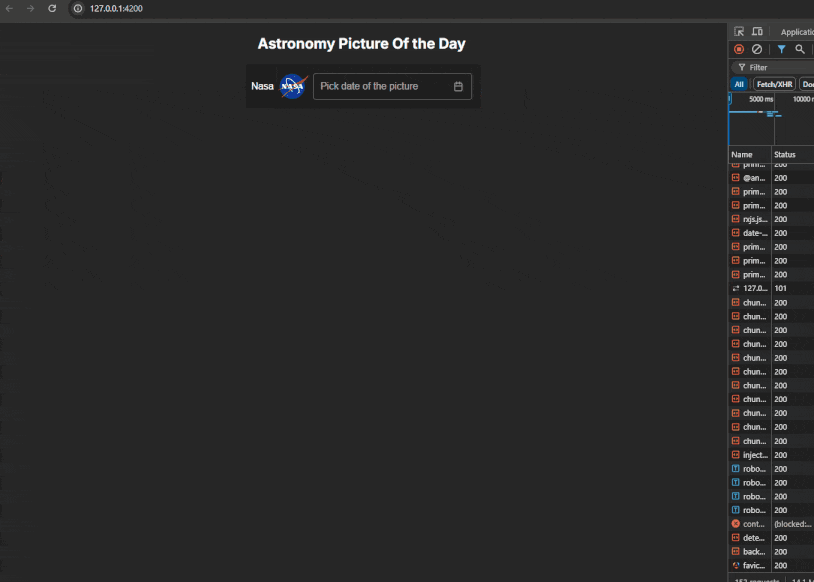

import Note from "@components/content/Note.astro";
import { Image } from "astro:assets";
import carniatoWebComponents from "@assets/async-angular-signals/carniato-web-components.png";
import richHarrisWebComponents from "@assets/async-angular-signals/rich-harris-web-components.png";
import htmxLogo from "@assets/async-angular-signals/htmx-logo.png";
import H3 from "@components/content/H3.svelte";
import H4 from "@components/content/H4.svelte";

<H3 title="The Frontend Ecosystem lately" />

The world of frontend development is always buzzing with new ideas, tools, and frameworks. It's like a giant playground where everyone’s trying out cool new toys.
But slowly over the past years, something surprising has been happening: the authors behind these frameworks are starting to agree on some key ideas. Shocking, right?

For example many agree on:
* Server-side rendering (SSR) is a must

Many frameworks keep pushing the boundaries of what is possible with SSR. And since it boosts performance and SEO, it’s become the “must-have” feature.

* Components over templating

It’s all about components now! Forget templating, component based architecture is the new standard. Almost everyone’s on board. (Okay, maybe not everyone, but close enough. <Image src={htmxLogo} alt="htmx logo" style={"width: 35px;display: inline;margin: 0;"} />)

* Web Components Are… Not Fun?

Let’s just say web components haven’t won the popularity contest. Most devs agree they’re tricky to use, so you’d better have a pretty convincing reason to pick them over regular frameworks.

<div class="flex gap-5 justify-between">
    <a href="https://dev.to/ryansolid/web-components-are-not-the-future-48bh">
        <Image src={carniatoWebComponents} alt="carniato web components blog post" style={"width: 320px;"} />
    </a>
    <a href="https://dev.to/richharris/why-i-don-t-use-web-components-2cia">
        <Image src={richHarrisWebComponents} alt="rich harris web components blog post" style={"width: 345px;"} />
    </a>
</div>

* Signals everywhere

Signals ha’ve taken the community by storm, and for good reason!
Like I mentioned in a <a class="underline" href="/blog/angular-signals" target="_blank">previous post</a> signals are becoming the new "must-have feature". <a class="underline" href="https://x.com/ryancarniato" target="_blank">Ryan Carniato</a>
popularized the idea of them through <a class="underline" href="https://www.solidjs.com/" target="_blank">SolidJS</a>. Soon after many frameworks followed like Svelte5, Angular, Vue, Preact, Qwik.

<H3 title="Why do we need signals?" />
The short answer is: we don't. Just like we don't need a Virtual DOM, component-based architectures, or even an SPA framework to deliver a better UX.
What signals offer is a fresh perspective: simplicity, readability, ease of use, and direct dependency tracking.
They allow you to reduce complexity and manage reactivity in a more intuitive, straightforward way, and all of this natively!

<H3 title="Understanding signals." />
Using the actual definition of signals from <a class="underline" href="https://angular.dev/" target="_blank">Angular</a>
in particular *(although the underlying concept should be the same for the rest)* we get:



The key takeaways from the above is that signals:
-- Help the framework to **optimize** rendering updates.

Signals ensure that whenever you access their values, **you always** get the latest values. Moreover `computed` signals
are **lazily evaluated**. This also guarantees glitch-free UI synchronization.
-- **Granularly** track our state.

Signals operate at a fine-grained level, allowing you for more precise control over updates and reactivity.

<H4 title="All signals operations are synchronous!" />
Updating a signal happens synchronously, and any `computed` signal dependent on it will immediately reflect the change.
Watchers are also notified synchronously as well.

<Note title="Note">
    The `effect`'s primitives that many frameworks provide us by wrapping these watchers, allows the framework to control when they execute.
    This means that effects are **always asynchronous**, as their execution is scheduled rather than immediate.
</Note>

<H3 title="Leveraging signals for asynchronous operations." />

Since we've established that all signal operations are synchronous, how can we leverage their benefits for asynchronous operations?
There are some approaches and some best practices when using signals for that.

So we will see a small demo of an app and try to replicate it with different approaches and explain why some of them preferable and some are not.

<H4 title="Demo App" />
Our objective is to implement a lightweight asynchronous feature: fetching the astronomy picture of the day from NASA's API for a specified date.
When the date changes, it should trigger a new fetch, and any ongoing requests should be canceled to handle updates efficiently.

<a href="https://api.nasa.gov/planetary/apod?api_key=API_KEY&date=${date}&concept_tags=True" target="_blank" class="subtitle text-xs">*NASA's endpoint*</a>

<H3 title="Rxjs focused approach" />
First, let's explore a more traditional RxJS-focused approach. By using a `Subject` combined with `switchMap`, we can initiate and cancel ongoing requests efficiently.

```typescript title="traditional-rxjs.ts"
dateSubject = new BehaviorSubject<Date | undefined>(undefined);
pictureOfTheDayService = inject(PictureOfTheDayService);

pictureOfTheDay = signal<PictureOfTheDay | undefined>(undefined);

constructor() {
    // I prefer to use a subject over `toObservable` because
    // the latter is using an `effect` underneath.
    this.dateSubject.pipe(
        switchMap(date => this.pictureOfTheDayService.get(date)),
        takeUntilDestroyed()
    ).subscribe(pictureData => this.pictureOfTheDay.set(pictureData))
    // Using only signals to synchronize UI with component state--^
}
```
There couple things we can note here. Not only we take advantage of powerful RxJS operators but the
key benefit here is that we maintain a unidirectional state pattern by seting our state at the end of our asynchronous flow.
This means we have a signle state of truth that always remains immutable and only then we ensure UI consistency as well by leveraging the
power of signals to seamlessly synchronize the UI.

However we have a small drawback here, we need to break our declarative paradigm since we need to `subscribe`, imperativly set our data, and
handle the subscription itself.

<H3 title="Naive signals approach" />
In this case, our date signal triggers the effect, and inside the effect, we store the data using again the pictureOfTheDay signal.
```typescript title="naive-signals.ts"
date = model<Date>();
pictureOfTheDayService = inject(PictureOfTheDayService);

pictureOfTheDay = signal<PictureOfTheDay | undefined>(undefined);

fetchPicture = effect(async () => {
    const pictureData = await this.pictureOfTheDayService.getAsPromise(this.date());
    this.pictureOfTheDay.set(pictureData); // I'm the trigger of this flow ---^
}, { allowSignalWrites: true }); // Not longer needed after Angular19
```
But our example above lacks the functionality of a `switchMap` like before.
Also we are setting a signal within an `effect` block.

<H4 title="Seting a signal within an effect." />
Seting a signal within an effect can create couple issues. Depending on the implementation
it can create "glitches" since it is scheduled by the framework and the timing of some operations may not
be so intuitive at first *(will elaborate later)*, also it could produce an infinite loop:
```typescript title="infinite-fun.ts" {5}
myNum = signal<number>(0);

myDeadlyCycle = effect(() => {
    console.log("My number is: ", this.myNum()); // I'm a depedancy of this effect
    this.myNum.update(num => ++num); // I'm triggering my dependants
});
```
If you cannot avoid the above pattern for whatever reason you could utilize the `untracked` API provided
by the Angular team.
```typescript title="end-infinite-fun.ts :("
myNum = signal<number>(0);

myNotSoDeadlyCycle = effect(() => {
    untracked(() => {
        console.log("My number is: ", this.myNum()); // I'm NO longer a depedancy of this effect
    })
    this.myNum.update(num => ++num); // I'm triggering my dependants
});
```
And while we could utilize `untracked` to make our previous example more readable and have more depedancy control,
we would still lack the `switchMap` behavior.

<H3 title="Use of third party libs" />
We bridge this gap between our signals and Rxjs we could utilize third party libraries like: `ngxtension`.
From that we could use `derivedAsync` API which brings the best of both worlds:
```typescript title="ngxtension-derived-async.ts"
date = model<Date>();
pictureOfTheDayService = inject(PictureOfTheDayService);

pictureOfTheDay: Signal<PictureOfTheDay | undefined> =
    derivedAsync(
        () => this.pictureOfTheDayService.get(this.date()),
        { behavior: 'switch' } // this is the default behavior if not provided
    );
```
Here `derivedAsync` makes the asynchronous call, provides us with back a `Signal` type, and it also manages to use the
Rxjs operators. How does it achieve all of this?

Well if we check parts of its source code:
```typescript title="derived-async.ts"
...
assertInjector(derivedAsync, options?.injector, () => {
    ...
    effect(() => {
        // we need to have an untracked() here because we don't want to register the sourceValue as a dependency
        // otherwise, we would have an infinite loop.
        // this is needed for previousValue feature to work
        const currentValue = untracked(() => {
            const currentSourceValue = sourceValue();
            return currentSourceValue.kind === StateKind.Value
                ? currentSourceValue.value
                : undefined;
        });

        ...

        untracked(() => {
            sourceEvent$.next(
                isObservable(newSource) || isPromise(newSource)
                    ? newSource
                    : of(newSource as T),
            );
        });
    });
    ...
}
```
<a href="https://github.com/ngxtension/ngxtension-platform/blob/main/libs/ngxtension/derived-async/src/derived-async.ts#L197" target="_blank" class="subtitle text-xs">
    *Source code of `derivedAsync`*
</a>

We notice the following:
1. Uses the `effect` block to schedule the asynchronous operation.

2. Forces the user to run the `effect` inside an injector context.
<small>*This is because the `effect` uses the `DestroyRef` service to `unsubcribe`.*</small>

3. Makes use of the `untracked` API to ensure to avoid an infinite loop.
4. Utilizes a Subject instead of a signal.

This is happening for two reasons. First of all it uses `pipe()` into the Rxjs operators,
and most imporantly (although not the case here) its to ensure that all the events will be **eagerly propageted** to the system.

<H3 title="Native solution." />
Thankfully now with <a href="https://blog.angular.dev/meet-angular-v19-7b29dfd05b84" class="underline" target="_blank">Angular19</a> we do not need to use **any** external
library to achieve this behavior not even Rxjs! Especially for newcomers I think this is a great selling point.
<H4 title="Resources object." />
With <a href="https://blog.angular.dev/meet-angular-v19-7b29dfd05b84" class="underline" target="_blank">Angular19</a> we also get the `resources()` API.
Which although still experimental its proven very promising.
```typescript title="resources.ts"
date = model<Date>();
pictureOfTheDayService = inject(PictureOfTheDayService);

pictureOfTheDayResource = resources({
    request: this.date, // when I change I trigger the callback below.
    loader: async ({ request: date }) => // this callback runs inside an effect!
        await this.pictureOfTheDayService.getAsPromise(
            date
        ),
})
```
With this approach all we need to do is pass a callback to the `loader` property and also give it the `request` property which
basically tells the resource object to repond to changes from the provided signal.
<Note title="Note">
Not passing anything as a request and simple calling the signal in the callback, is also useful and can be used to fetch **once** the resource.
```typescript title="resources-fetch-once.ts"
    pictureOfTheDayResource = resources({
        loader: async () => // I will run once
            await this.pictureOfTheDayService.getAsPromise(
                this.date() // I'm calling the actual signal now
            ),
    })
```
</Note>

Not only that but it will also cancel any on-going HTTP calls using an `AbortSignal`, so we can have the same functionality we had with a `switchMap` operator!

Creating a resource object will provide us with other usefull signals as well:
```typescript title="resource.ts"
export interface Resource<T> {
    readonly error: Signal<unknown>;
    readonly isLoading: Signal<boolean>;
    readonly status: Signal<ResourceStatus>;
    readonly value: Signal<T | undefined>;
    ...
}
```
<H3 title="Linking signals." />
Lets try now to expand our app by adding a gallery for favorite days. With this feature, you can save specific days to local storage and later view them,
along with their descriptions, without needing to fetch them again.


So our feature is working great, except from the fact that when we update our `date()` signal **after** we have selected a picture from our
gallery doesn't seem to show our newly fetched picture.

If we check our implementation it makes sense since in our template:
```html title="aod.html"
<!-- We always try to render the selectedPicture() if it exists -->
@if (selectedPicture()); as selectedPicture) {
    <app-picture-of-the-day (saveClick)="onSave($event)">
    </app-picture-of-the-day>
} @else if (pictureOfTheDayResource.value()) {
    <app-picture-of-the-day (saveClick)="onSave($event)">
    </app-picture-of-the-day>
}
```
Well one obvious solution to our issue it would be to maybe reset our `selectedPicture` when our `date` changes.
```typescript title="avoid-this-effect-use.ts"
resetEffect = effect(() => {
    this.date(); // trigger the callback

    this.selectedPicture.set(undefined);
})
```
And while the above works for our usecase, its a bad idea because like we mentioned already `effect`'s are scheduled
which means that we have sometime between our `date` signal being set and our actual `effect` being scheduled to run.
This can create glitches to the user, if not careful enough.

What would you do instead is this:
```typescript title="reactivly-linking-signals.ts"
state = computed(() => ({
    date: this.date(),
    selectedPicture: signal<PictureOfTheDay | undefined>(undefined)
}));
```
we could shift our perspective and initialize a completely new signal directly when we receive a new value. This way, we eliminate
the need for resetting and ensure the signal is updated reactively and consistently.

Alternativly you could use a new experimental API called `linkedSignal`:
```typescript title="linked-signals.ts"
selectedPicture: WritableSignal<PictureOfTheDay | undefined> = linkedSignal({
    source: this.date,
    computation: () => undefined
});
```

<H3 title="✨ TLDR ✨" />
In conclusion its worth keeping in mind the following:
* ✅ Use signals if it alleviates complexity.
* ✅ Use signals for UI synchronization.
* ❌ Avoid signals for very complex asynchronous operations. (case dependant ofc)
* 👉 Signals when accessed are always providing the latest value.
* 👉  `computed` signals are lazily evaluated.
* 👉 Effects are primitive wrappers of `watchers` signals.
* 👉 Effects are always asynchronous and framework dependant.
* ❌ Do NOT use `effect` to synchronize the state or other signals.
