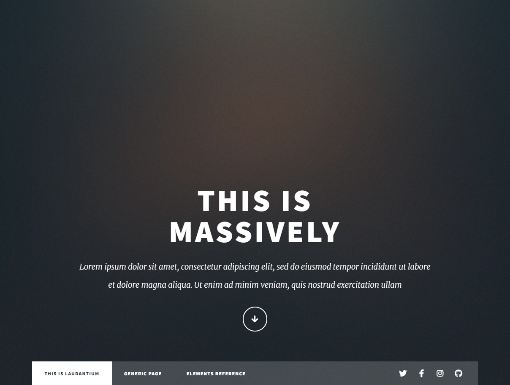
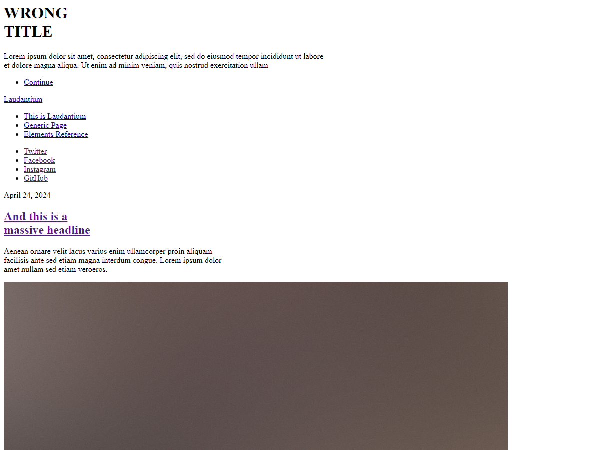
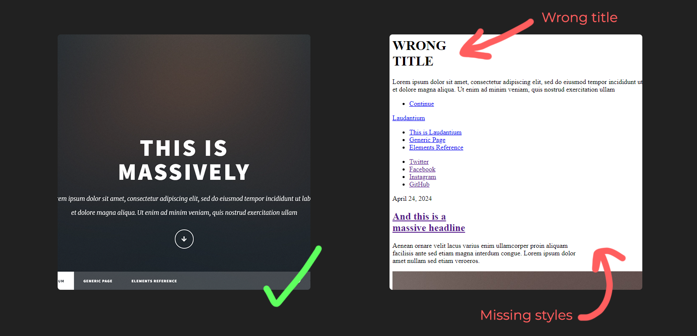

import hellYeah from "../../assets/git-bisect/hell-yeah.gif";
import amazedFace from "../../assets/git-bisect/amazed-face.gif";
import sadCat from "../../assets/git-bisect/sadcat.png";
import Note from "../../components/ui/Note.astro";
import { Image } from "astro:assets";

Recently at work, I encountered a couple of complex bugs with unclear origins,
making it difficult to pinpoint exactly when they first appeared. In general
as codebases grow larger and more complex, tracking down the source of bugs can
become increasingly challenging. Fortunately, Git provides a powerful tool called
`git bisect` that can help pinpoint the exact commit that introduced a bug.
In this post, we'll see how to use git bisect effectively to save a lot of time and streamline your debugging process.

## What is Git Bisect?

Git bisect is a binary search tool that helps you find the commit that introduced
a bug in your project. By marking known "good" and "bad" commits, git bisect can
automatically checkout commits between those points, allowing you to test each
one until you locate the problematic change.

### Example use
Let's consider a scenario where we travel back in time and our website used to look like this:

#### Our good state

And let's assume that this state was back in some random commit with hash `e4824da`.

#### All hell broke loose 
Some time passes by, more commits are coming in and everything is working. However after a while we notice that the site looks like this...


We notice that there are two new bugs appearing compared to the old version:


We are puzzled by how long these issues had persisted and which specific commit might 
have introduced them. Its time to use `git bisect` <Image src={amazedFace} alt="amazed face" style={"width: 35px;display: inline;margin: 0; transform: scaleX(-1)"} />
```sh
> git bisect start
```
Let's try and resolve the first issue regarding the missing styles, we will need to know the
commits for our <b>good</b> and <b>bad</b> states. So we `git log` to find the hash of our commits/states.

```sh
> git log --oneline

d138661 (HEAD -> master) chore: update project desc  <-- We will mark this as "bad"
a8b9468 chore: version bump
321c4d7 fix: change the date for all the links
d68679a feat: change the date
162f406 chore: remove more comments
19f6b7f feat: change the name
1e094ed fix: month should be in aug
a9c3f07 fix: wrong address in footer
e4824da chore: remove comments                      <-- We will mark this as "good"
0d4fb6b feat: add test cases
437c478 feat: add jest and jsdom depedencies
a971818 Initial commit
```
We will mark `d138661` (master) as "bad" commit/state as we've confirmed that our site is broken while on it.
```sh
> git bisect bad d138661
```
<Note title="Note">
    ```sh
    > git bisect bad
    ```
    <br/>
    If we don't add a commit number, Git will use the current branch as the 'bad' commit.
</Note>
Likewise we will mark `e4824da` as "good" because we're certain that when we are on that commit everything is fine.
```sh
> git bisect good e4824da
Bisecting: 3 revisions left to test after this (roughly 2 steps)
[162f40681aff305047e94fd6649693135b11b717] chore: remove more comments
```
Now we see that Git has automatically checked out a commit right in the middle of our two states.
```sh
❯ git status
HEAD detached at 162f406
You are currently bisecting, started from branch 'master'.
  (use "git bisect reset" to get back to the original branch)
```
We check if our site's styles are applied but it seems that the issue persisted so we mark the commit as bad
```sh
> git bisect bad
Bisecting: 1 revision left to test after this (roughly 1 step)
[1e094edc1a54fa883e68a937c7ad96d095bf2a0d] fix: month should be in aug
```
We check again but no luck...So we mark this commit as bad as well and we continue
```sh
> git bisect bad
Bisecting: 0 revisions left to test after this (roughly 0 steps)
[a9c3f0710e25f4d2c77abe95ca534d936668f0d7] fix: wrong address in footer
```
We check our site and our styles are back!! We mark this commit as "good" and
by that `git bisect` gives us the <b>first</b> "bad" commit.
```sh
> git bisect good
1e094edc1a54fa883e68a937c7ad96d095bf2a0d is the first bad commit
commit 1e094edc1a54fa883e68a937c7ad96d095bf2a0d
Author: cloud-np <nipa04@betssongroup.com>
Date:   Tue Sep 24 15:47:01 2024 +0200

    fix: month should be in aug
    
    ref: #T-31

 index.html | 2 +-
 1 file changed, 1 insertion(+), 1 deletion(-)
```
Now we found our faulty commit and finish the process with:
```sh
git bisect reset
```
But let's investigate the faulty commit.
```sh {18}
❯ git show 1e094edc1a54fa883e68a937c7ad96d095bf2a0d
Author: cloud-np <random@mail.com>
Date:   Tue Sep 24 15:47:01 2024 +0200

    fix: month should be in aug
    
    ref: #T-31

diff --git a/index.html b/index.html
index 7d86d29..1ffcdc3 100644
--- a/index.html
+++ b/index.html
@@ -4,7 +4,7 @@
                <title>Massively by HTML5 UP</title>
                <meta charset="utf-8" />
                <meta name="viewport" content="width=device-width, initial-scale=1, user-scalable=no" />
-               <link rel="stylesheet" href="assets/css/main.css" />
+               <link rel="stylesheet" href="assets/css/maincss" />
                <noscript><link rel="stylesheet" href="assets/css/noscript.css" /></noscript>
        </head>
        <body class="is-preload">
```
We can see that we accidentally messed up the link reference 🤦. Now that we found the culprit lets remove it.

```sh
> git rebase -i 1e094edc1a54fa883e68a937c7ad96d095bf2a0d^

# pick 1e094ed fix: month should be in aug <-- Delete this or comment it out
pick fa67797 feat: change the name
pick 687e5eb chore: remove more comments
pick 1b7284d feat: change the date
pick 84a4b45 fix: change the date for all the links
pick 1544cff chore: version bump
pick 39f2d62 chore: update project desc
Successfully rebased and updated refs/heads/master.
```
Let's check now our site again while on `master` branch:

Nice! We got our styles back. However our title is still wrong... <Image src={sadCat} alt="sad cat" style={"width: 35px;display: inline;margin: 0;"} />
<br/>

### Automating git bisect
Let's try now to find the faulty commit again but this time make git do the check for us based on a "condition" we give it.
```sh
> git bisect start
> git bisect bad          # To mark current branch (master) as a bad commit
> git bisect good e4824da # We mark as good the same commit because it solves the issue
Bisecting: 3 revisions left to test after this (roughly 2 steps)
[687e5eb387387eb6476e4bf59b348e14159217a8] chore: remove more comments
```
But now I want to provide Git a custom test case I wrote for this specific bug which I want it to check everytime bisect a new commit.
```typescript
it('has the correct title in the intro section', () => {
    const introDiv = container.querySelector('#intro');
    const h1 = introDiv.querySelector('h1');
    expect(h1.textContent.replace(/\s/g, '')).toBe('ThisisMassively');
});
```
Let's use Git to automatically test each commit and mark them as "bad" or "good" based on whether the test case passes or fails.
```sh
> git bisect run npm test
running  'npm' 'test'

> git-bisect@1.0.0 test
> jest

 PASS  ./test_index.spec.js
 FAIL  ./custom-test.spec.js
  ● index.html › has the correct title in the intro section

    expect(received).toBe(expected) // Object.is equality

    Expected: "ThisisMassively"
    Received: "WRONGTITLE"

      17 |     const introDiv = container.querySelector('#intro');
      18 |     const h1 = introDiv.querySelector('h1');
    > 19 |     expect(h1.textContent.replace(/\s/g, '')).toBe('ThisisMassively');
         |                                               ^
      20 |   });
      21 | });
      22 |

      at Object.toBe (custom-test.spec.js:19:47)

Test Suites: 1 failed, 1 passed, 2 total
Tests:       1 failed, 4 passed, 5 total
Snapshots:   0 total
Time:        1.024 s
Ran all test suites.
Bisecting: 0 revisions left to test after this (roughly 1 step)
[fa67797db045c96d2d92e5ce3026904287f227e5] feat: change the name
running  'npm' 'test'

> git-bisect@1.0.0 test
> jest

 PASS  ./custom-test.spec.js
 PASS  ./test_index.spec.js

Test Suites: 2 passed, 2 total
Tests:       5 passed, 5 total
Snapshots:   0 total
Time:        0.94 s, estimated 1 s
Ran all test suites.

############################
# It found the bad commit!
687e5eb387387eb6476e4bf59b348e14159217a8 is the first bad commit
commit 687e5eb387387eb6476e4bf59b348e14159217a8
Author: cloud-np <nipa04@betssongroup.com>
Date:   Tue Sep 24 13:25:48 2024 +0200

    chore: remove more comments
    
    ref: #T-10

 index.html | 11 ++---------
 1 file changed, 2 insertions(+), 9 deletions(-)
bisect found first bad commit
############################
```
As demonstrated above, `git bisect run` executed the command we provided, multiple times across different commits in the repository's history.
This automated process efficiently identified the first commit where our test succeeded, indicating that the commit immediately preceding it
was the first "bad" commit that introduced the issue.

Now we can remove this faulty commit the same way we did before:
```sh 
> git rebase -i 687e5eb387387eb6476e4bf59b348e14159217a8^
```

Finally let's again our site again:


Nice! <Image src={hellYeah} alt="amazed face" style={"width: 35px;display: inline;margin: 0;"} />
We not only tackled the actual bug but also automated the process, minimizing both our effort and the potential for any human error.

### Conclusion
Git bisect is a really useful tool for efficiently tracking down bugs in large codebases.
Although in these trivial examples above it could not be that obvious straight away. By leveraging its binary
search algorithm, we can save time and frustration when debugging. Whether used manually
or with automation, `git bisect` could be a very usefull toolkit especially when you need to indentify which commit
to revert fast.

Remember, the key to effective debugging is not just finding the bug, but understanding why it occurred.
Once we've identified the problematic commit with `git bisect` and resolve the issue, we can take the time to analyze the changes and
prevent similar issues in the future.